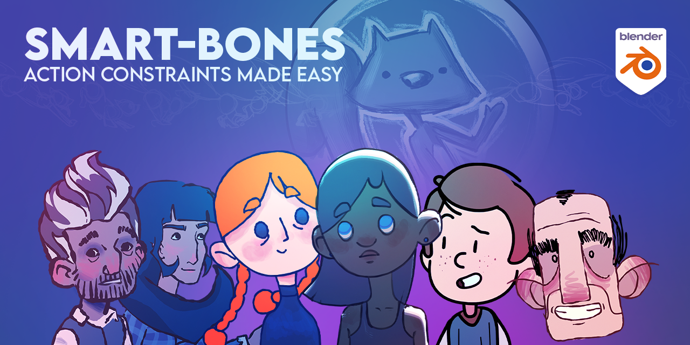

Smart Bones is an add-on for Blender that automates the process of adding action constraints to keyed bones within a selected action.

## Installation
1. Download the SmartBones.py file from the [Github repository](https://github.com/sketchy-squirrel/smart-bones).
2. Open Blender and go to Edit > Preferences > Add-ons.
3. Click on Install... and select the downloaded SmartBones.py file.
4. Make sure that the checkmark next to the add-on is enabled.
5. Click on Save Preferences.

## Usage
1. Select the armature you want to add constraints to.
2. In the 3D View, go to the Smart Bones menu, and click on Smart Bone Tool.
3. In the Smart Bone Tool panel, select the target armature, control bone, and the transform channel for the constraint.
4. Choose the transform space from the drop-down list.
5. If you select CUSTOM in the space option, specify the name of the object you want to take local space from and the custom subtarget, if necessary.
6. Set the minimum and maximum values for the transform range.
7. Specify the name of the affected action, as well as the start and end frames for the action.
8. Click on the Add Smart Bone button to add the action constraint to all bones in the action.

## Properties
* Target: the name of the control armature.
* Control: the name of the control bone.
* Channel: the control axis.
* Space: the transform space, either WORLD, CUSTOM, or LOCAL.
* Space Object: takes local space from another object, to apply to constraint.
* Space Subtarget: custom space target, if Space Object is of type ARMATURE.
* Min Transform Range: the minimum transform value.
* Max Transform Range: the maximum transform value.
* Action: the name of the affected action.
* Min Frame: the start frame of the action.
* Max Frame: the end frame of the action.

## Operator
* Add Smart Bone: adds action constraints to all bones in the selected action.

## Compatibility
The add-on is compatible with Blender 2.80 and newer versions.

## Credits
Sketchy Squirrel
